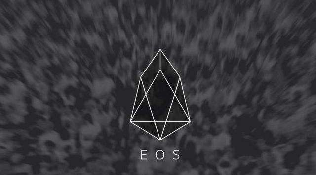

# 区块链快速入门： EOS 开发 DAPP 路径 指北针

为了更好的帮助区块链开发者开始完成 EOS 的学习和开发，现在由我在北京组建一个 EOS 开发学习路径兴趣小组，如果你愿意完成路径的开发的工作，可以联系我和其他的小伙伴一起在北京完成 EOS 的路径开发工作，后续会得到各种活动的优惠和创业型公司的推荐。

肖威 EOS 路径学习小组 发起人

才华横溢科技董事长、横溢资本创始人、区块链研习社特邀讲师

2018年5月18日

# 前言

基于我自己在星云链和以太坊方面的开发经验，我将以欧斯的开发也定义为如下几个方面：

- （1）钱包的问题
- （2）代币的问题
- （3）合约的开发和合约的部署问题
- （4）前端布局和前端设计的问题
- （5）前端和后端的接口的调用问题

我们会基于以上的五个维度，通过真实的开发一款可以使用的基于 EOS 的开发的 DAPP 逻辑，完成我们的教学的内容，然后在反过来看现在 EOS 的发展历史和关于 EOS 数字化货币投资的相关的现实问题。

## 第一部分：EOS 入门篇

**WHY TO DO:**
- （1）[EOS 创始人 BM 小自传：汤强](chapters/rumenpian/1.md)
- （2）[Ivan 采访 BM：汤强](chapters/rumenpian/7.md)
- （3）[BM 演讲：EOS没有竞争对手：荣格财经](chapters/rumenpian/8.md)

**WHAT TO DO:**
- （4）[EOS 白皮书分析：老猫](chapters/rumenpian/2.md)
- （5）[EOS 评级报告：TokenIn](chapters/rumenpian/5.md)

**HOW TO DO:**
- （6）[EOS 21 个超级节点:链内参](chapters/rumenpian/3.md)
- （7）[EOS 线上 DAPP 概述](chapters/rumenpian/4.md)
- （8）[“Hack Til Dawn”——线上黑客马拉松:EOS Cannon](chapters/rumenpian/6.md)

## 第二部分：EOS 提高篇
- （1）EOS 环境搭建流程
- （2）EOS 开发逻辑步骤
- （3）EOS 开发注意事项

## 第三部分：EOS 实战篇
- （1）钱包的问题
- （2）代币的问题
- （3）合约的开发和合约的部署问题
- （4）前端布局和前端设计的问题
- （5）前端和后端的接口的调用问题

# 致谢
感谢一下开源社区的同志们份付出。

 @汤强 @老猫 @肖威
